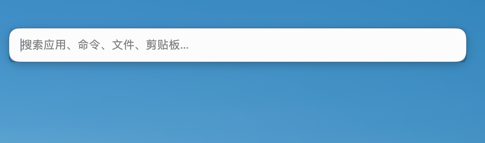

# Qingyu (清羽)

**English** | [简体中文](README.zh-CN.md)

> A local-first macOS productivity tool — lives in the menu bar, opens with `⌥ Space`.

Qingyu collapses "launch an app, find a file, do the math, run a common system
action" into one unified search entry, and keeps your clipboard history on your
Mac. No account required — just download and run.

---

## Download

**[Get the latest release from GitHub Releases →](https://github.com/freeabyss/qingyu/releases)**

- Requires macOS 12 Monterey or later (universal: Apple Silicon and Intel)
- Distributed as a `.dmg` (universal, **ad-hoc signed — not notarized yet**) — double-click, drag Qingyu into Applications, then approve it once under **System Settings → Privacy & Security**
- After installation, Qingyu moves the downloaded installer to the Trash on first launch
- Distributed via **GitHub Releases only** — **not** the Mac App Store
- No account required; no payments, subscriptions, or license keys
- The in-app **About → Check for Updates** action opens the Releases page above;
  it never downloads or installs anything automatically

> If macOS blocks the first launch, choose "Open Anyway" under
> **System Settings → Privacy & Security**.

## Features

### `⌥ Space` Unified Search

A centered command bar. Results come from **apps, commands, calculator, files,
and settings** — clipboard history is **not** mixed into this search (use the
clipboard window or the **Open Clipboard History** command instead).

| Source | Behavior |
| --- | --- |
| **Apps** | Scans `/Applications`, `~/Applications`, `/System/Applications`; `⏎` launches |
| **Files** | Searches Desktop, Documents, Downloads by default; `⏎` opens, `⌘C` copies the path |
| **Calculator** | Parses math expressions and unit conversions locally |
| **Commands** | Pre-registered built-in actions (see below) |
| **Settings** | Jumps to the matching settings page |

- English / Chinese keywords, pinyin, and pinyin initials
- Match quality: left-aligned (prefix) ranks above suffix, suffix above
  middle-of-name contains; search input has **no** leading magnifying-glass icon
- Empty query: **Recently used** and **Favorites** only (no duplicate quick-action block)
- Opens on the display **under your pointer** on multi-monitor setups

### `⌥⌘C` Clipboard History

Chrome-free window: full-width search, type chips (**All / Text / Image / File**),
history list on the left and a detail pane on the right.

- Records text (including rich text, shown as **Text**), images, and Finder file references
- List rows show the **source app icon** when known (e.g. Arc, Safari)
- Row actions are always visible: pin, copy, delete; files also get **Reveal in Finder**
- Missing original image files are dropped from the list; missing files get a toast
  instead of a silent no-op when revealing in Finder
- Duplicate content is merged by digest; retention 7 / 30 / 90 days or forever (default 30)
- Recording can be paused; clearing everything requires confirmation
- File records store paths and metadata only — **never file contents**

Clipboard search stays inside this window. Command-bar search does not include
clipboard history by default (可在设置中关闭/开启搜索源).

### Built-in Commands

| Category | Commands |
| --- | --- |
| Navigation | Open System Settings, Open App Settings, Open Downloads, Open Applications, Open Desktop, Open Finder |
| Clipboard | Open Clipboard History, Clear Clipboard History, Pause or Resume Clipboard Recording |
| System | Check Permissions, Restart Finder, Restart Dock, Toggle Appearance, Lock Screen, Sleep, Restart Mac, Shut Down |

Only pre-registered actions run — **arbitrary shell commands are never parsed or
executed**. Destructive / power actions require a second confirmation.

### `⌥⌘,` Settings

Pages: **General** (appearance, language,
startup, permissions, data usage), **Quick Launch** (hotkey, search sources,
file search directories), **Clipboard** (recording toggle, retention, clear),
and **About**.

- Appearance: Follow System / Light / Dark
- Menu bar: Open Search, Clipboard History, Settings, Quit (About lives in Settings)

Interface language: **Follow System**, **Simplified Chinese**, **English**.

## Privacy

Qingyu is local-first and offline by default:

- Clipboard content, usage frequency, and settings all stay on your Mac in
  `~/Library/Application Support/Qingyu/`
- No account required; no cloud sync, analytics, or payment services
- The file index is built locally; file names and paths are never uploaded
- Feedback is user-initiated email only. The generated message contains the app
  version, build number, macOS version, and your notes — it **never attaches**
  clipboard history, screenshots, files, or crash logs

Read the full [Privacy Policy](PRIVACY.md).

### Permissions

| Permission | Purpose | When requested |
| --- | --- | --- |
| **Accessibility** | Keyboard/mouse simulation, window control | On demand, when a related feature is first used |
| **Apple Events** | Built-in commands that control other apps (e.g. Sleep / Restart / Shut Down) | Before the first such command runs |
| **Clipboard** | macOS shows no separate prompt for clipboard reads | On by default; pausable and clearable anytime |

Declining any permission never blocks you from using the app.

## Roadmap

### Screenshots & Pinning (Snipaste-style, gated, not yet shipped)

Single capture entry, annotation tools, color picker, and pin-to-float windows.
Code is implemented but held behind a feature gate until multi-display / TCC /
signing acceptance.

### Window Tiling / Window Pinning / Context Menu Extension (planned)

Not started. Plans, not commitments.

### Also considered

- Automatic update checks (today: manual navigation to Releases)
- Screenshot OCR

## Screenshots

The `⌥ Space` command bar (input state).

Planned shots — captured from a signed build on a clean desktop and stored in
[assets/product/](assets/product/README.md):

| Shot | Shows |
| --- | --- |
| `command-bar-results.png` | Command bar with apps, files, calculator and commands |
| `command-bar-home.png` | Empty-query state — frequent actions and recent use |
| `clipboard-history.png` | `⌥⌘C` clipboard window — filters, list and detail pane |
| `settings-general.png` | Settings · General (plugins, appearance, language, data) |
| `onboarding.png` | First-run welcome guide |

> ⚠️ Only the command bar shot is committed so far; the rest are pending. See the
> capture procedure in [assets/product/README.md](assets/product/README.md).

Product homepage: <https://freeabyss.github.io/qingyu/>

## License

Qingyu is **free for personal, non-commercial use**, but **commercial use is
prohibited**, and the project owner reserves the right to introduce paid
features or commercial licensing in future versions.

Without prior written permission you may not use this software in any business
operation, sell, redistribute, sublicense, or distribute modified versions.
See [LICENSE](LICENSE).

For commercial licensing: <qingyu_freeabyss@163.com>

This software includes third-party open-source components, each under its own
license. See [THIRD_PARTY_NOTICES.md](THIRD_PARTY_NOTICES.md).

## Version History

See [CHANGELOG.md](CHANGELOG.md) and
[GitHub Releases](https://github.com/freeabyss/qingyu/releases).

## Feedback

Bug reports, feature requests, commercial licensing: <qingyu_freeabyss@163.com>

Or open an [Issue](https://github.com/freeabyss/qingyu/issues) directly.
