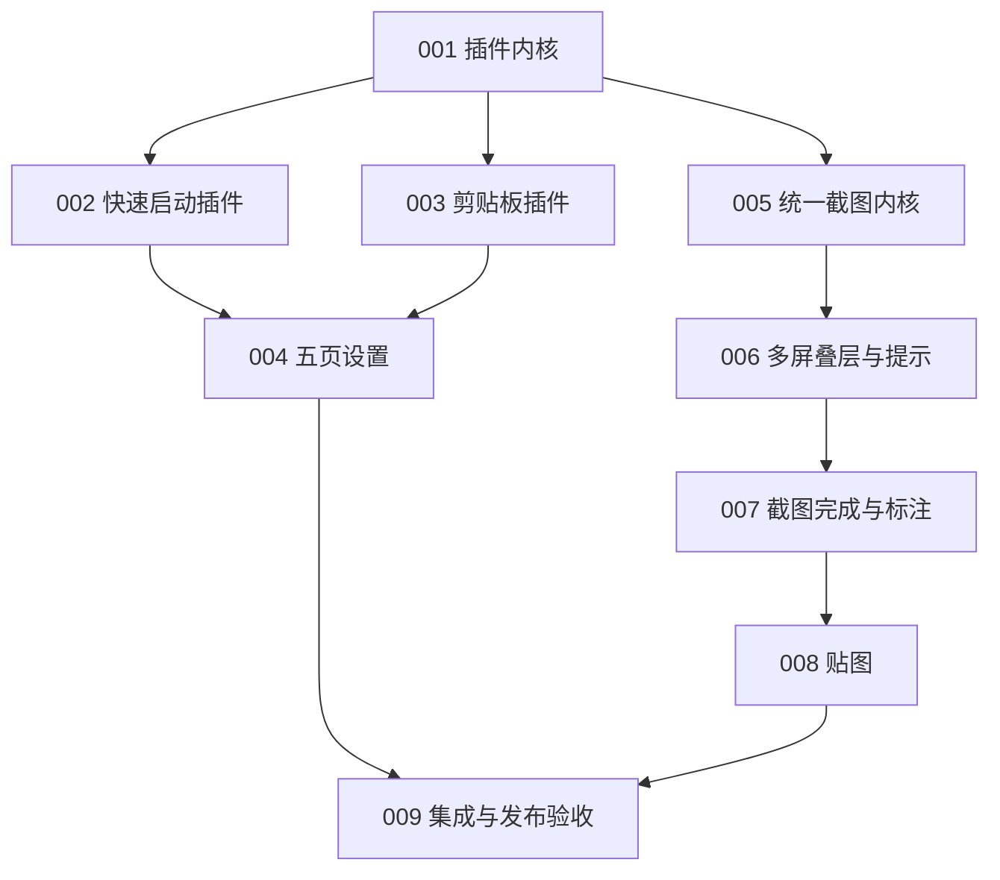

# 青鸟下一阶段执行计划

> **For agentic workers:** 每个 Task 必须在独立会话中执行。只读取当前 Task、`AGENTS.md`、Task 指定的 PRD/架构章节和相关源码。完成测试与评审后再进入下一 Task。

**目标：** 在保留现有搜索、剪贴板和 macOS 基础能力的前提下，建立第一方插件边界，收敛设置为 5 个页面，并完成统一、多显示器截图与贴图体验。

**架构：** 插件采用编译期注册的第一方模块，由 `PluginRegistry` 聚合搜索源、动作、菜单、快捷键、设置页和权限声明。截图采用“纯状态机 + 捕获后端 + 多屏叠层控制器”分层，所有完成动作经统一协调器结束当前会话；MVP 不写入截图历史。

**技术栈：** Swift 5、SwiftUI、AppKit、ScreenCaptureKit、CoreGraphics、Core Data、KeyboardShortcuts、XCTest、XCUITest。

## Global Constraints

- 支持 macOS 13+；应用以 `LSUIElement=true` 的菜单栏 Agent App 运行。
- 插件仅由项目所有者开发，随主应用编译、签名和发布。
- 用户数据保存在当前 Mac；插件按需声明并请求权限。
- App Sandbox 保持关闭；发布保留 Hardened Runtime、Developer ID 和 Apple Notarization。
- 代码修改提交前运行 `./scripts/bump-version.sh --bump`；主版本保持 `0`，构建号同步递增。
- 版本单一事实来源是 `Qingniao/Info.plist`；`MARKETING_VERSION`、`CURRENT_PROJECT_VERSION` 必须同步。
- “关于”、更新和反馈从 Bundle 读取版本与构建号。
- 新 Swift 文件必须加入 `Qingniao.xcodeproj/project.pbxproj` 对应 target。
- 每个任务先写失败测试，再实现最小改动，最后运行 `./scripts/verify.sh`（全量单元测试 + `git diff --check`）并全部通过；截图会话生命周期回归用例见 `docs/test/cases.md` 第 12 节。
- 现有工作区含未提交修改；执行者必须保留无关改动，禁止重置或覆盖整个文件。

## 执行前决策

本计划采用以下 YAGNI 基线：插件是主应用内编译的第一方模块，运行在主进程中，跟随主应用安装、升级和卸载。`PluginRegistry` 不扫描磁盘、不加载外部 Bundle、不提供 SDK 或插件市场。若需要运行时加载，应先修改 PRD、补充安全模型并重写 Task 001。

## 执行门

1. 确认上述第一方编译期插件模型。
2. 当前源码工作区存在未提交修改；开始 Task 001 前，先把这些修改形成可回滚基线，或明确哪些修改属于本轮实现。
3. 一个 Task 使用一个独立 Agent 会话；前置 Task 的测试、评审和提交完成后再启动后继 Task。

## 当前实现差距

| 范围 | 当前状态 | 计划任务 |
|---|---|---|
| 插件 | `AppContainer` 直接构造搜索源、控制器和后台服务 | 001–003 |
| 设置 | 3 个侧栏分组、11 个页面 | 004 |
| 截图入口 | 单一截图入口，按指针位置和鼠标操作自动判定窗口、全屏或区域 | 005、009 |
| 多显示器 | 区域叠层只覆盖启动时指针所在屏；窗口/全屏依赖主屏 | 006 |
| 快捷键提示 | 截图左下角没有上下文提示 | 006 |
| 截图完成与高级标注 | 仅有基础区域选取及矩形、箭头、文字、马赛克 | 007 |
| 贴图 | 尚无模型、生命周期服务和窗口 | 008 |

## 任务顺序

| Task | 产物 | 前置 |
|---|---|---|
| [001](001-first-party-plugin-kernel.md) | 第一方插件契约、注册表、动作路由和 ADR | 无 |
| [002](002-quick-launch-plugin.md) | 快速启动插件迁移 | 001 |
| [003](003-clipboard-plugin.md) | 剪贴板插件迁移 | 001 |
| [004](004-five-page-settings.md) | 通用、快速启动、剪贴板、截图、关于 5 页设置 | 002、003 |
| [005](005-unified-capture-core.md) | 单一截图入口、自动模式判定与捕获后端 | 001 |
| [006](006-multidisplay-capture-overlay.md) | 全显示器叠层、跨屏切换、左下角快捷键提示 | 005 |
| [007](007-capture-completion-and-annotation.md) | 截图完成、取色、完成协调器和标注增强（不保留截图历史） | 006 |
| [008](008-pinning.md) | 贴图转换、生命周期和置顶窗口 | 007 |
| [009](009-integration-and-release.md) | 截图插件接线、旧链路清理、全量验收和发布检查 | 004、008 |

## 完成标准

- 三个内置功能以插件注册：快速启动、剪贴板、截图。
- 设置侧栏只显示通用、功能列表下的三个功能页、关于。
- 单一截图入口进入统一截图状态；窗口悬停默认选中窗口，菜单栏悬停默认选中全屏，圈选区域后自动截图；跨显示器移动指针后在对应显示器判定目标。
- 截图状态左下角显示当前可执行快捷键。
- 自动化测试通过；真实多屏、TCC、快捷键、签名和公证有人工验收记录。
